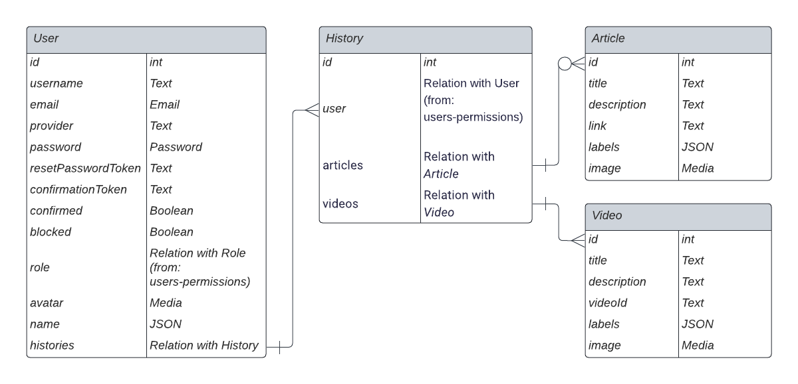

# Re-Create Backend
Unlock Creativity through all possibilities!

## Overview
### Software Architecture
We are using Cloud Run to deploy our service and Cloud SQL also GCS to store our data.

### Data Model
This is the data model that suits our business case.


## Getting started
### Prerequisites and requirements
Before installing Strapi, the following requirements must be installed on your computer:  
- [Node.js](https://nodejs.org/): Only Maintenance and LTS versions are supported (v14, v16, and v18).
    - Node v18.x is recommended for Strapi v4.3.9 and above
    - Node v16.x is recommended for Strapi v4.0.x to v4.3.8.
- Your preferred Node.js package manager:
  - [npm](https://docs.npmjs.com/cli/v6/commands/npm-install) (v6 and above)
  - [yarn](https://yarnpkg.com/getting-started/install)
- [Python](https://www.python.org/downloads/) (if using a SQLite database)

#### Clone and install dev
After cloning this repository you can just type this magic command✨.
```
npm install --save-dev
```

#### Modifying .env
First copy the [.env.example](./.env.example) into .env and fill the empty value.
```
cp .env.example .env
```

if you want to use your own DB to store the content, you can define it at the end of the file. but, for the sake of simplifying, you can just use SQLite. Moreover, you can suit yourself. look this [documentation](https://docs.strapi.io/dev-docs/configurations/server#available-options) for more.

### How To Run
Strapi comes with a full-featured [Command Line Interface](https://docs.strapi.io/developer-docs/latest/developer-resources/cli/CLI.html) (CLI) which lets you scaffold and manage your project in seconds.

#### `develop`

Start your Strapi application with autoReload enabled. [Learn more](https://docs.strapi.io/developer-docs/latest/developer-resources/cli/CLI.html#strapi-develop)

```
npm run develop
# or
yarn develop
```

#### `start`

Start your Strapi application with autoReload disabled. [Learn more](https://docs.strapi.io/developer-docs/latest/developer-resources/cli/CLI.html#strapi-start)

```
npm run start
# or
yarn start
```

#### `build`

Build your admin panel. [Learn more](https://docs.strapi.io/developer-docs/latest/developer-resources/cli/CLI.html#strapi-build)

```
npm run build
# or
yarn build
```

---
  
Our team consist: 
| Name | Bangkit-ID | 
| ------ | ------ | 
| Gabriel Imam Andaru  | M185DSX0115  | 
| Thomas Stefen Mardianto  | M017DSX0213  | 
| Sesa Arini Rahma | M169DSY2158  | 
| Rahadyanino Maheswara | C017DSX0836 | 
| Ersa Sa’dul Asyhar | C151DSX2015 | 
| Muhammad Devano Zaidan  | A185DSX2026 | 
  
Jump to related repositories:  
- [Machine Learning](https://github.com/gabriel-tama/ReCreate_ML)  
- [Android Development](https://github.com/Devanoz/Recreate-app)
